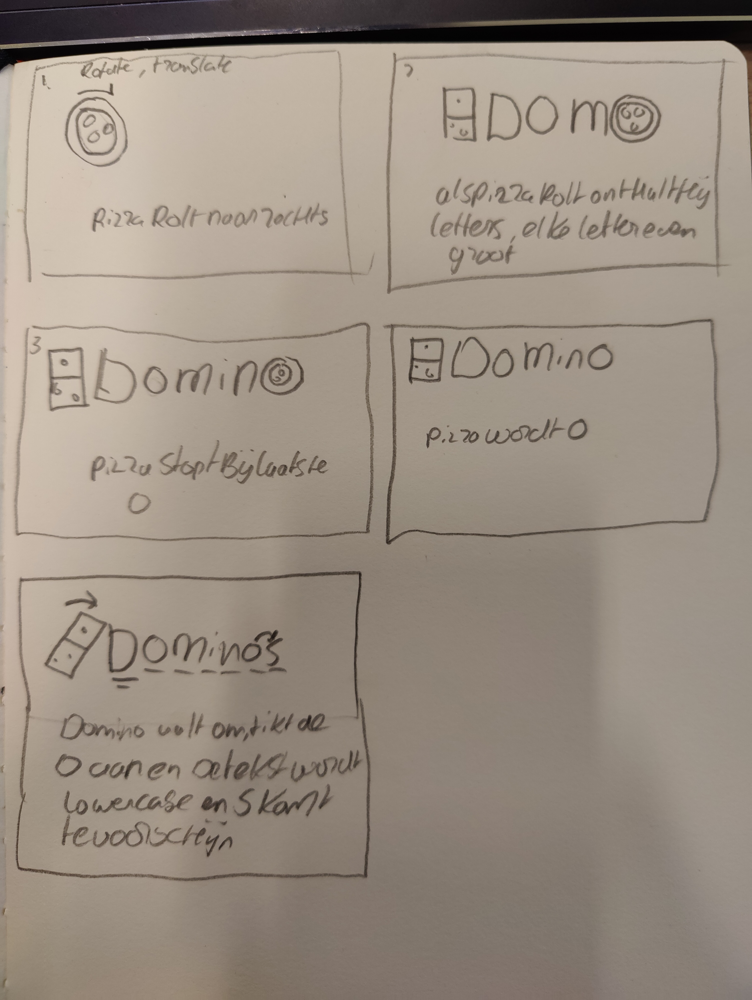
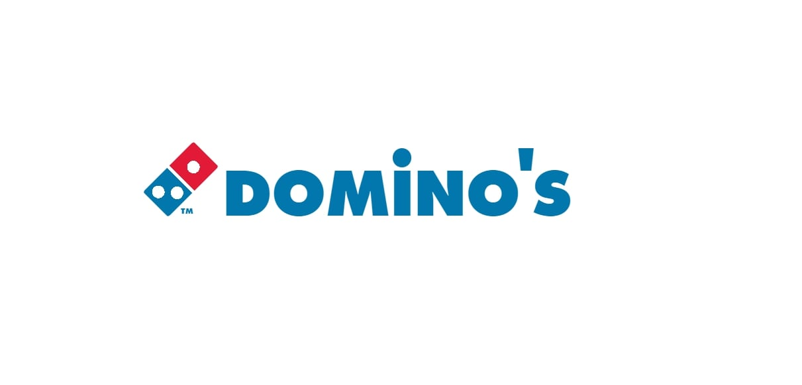
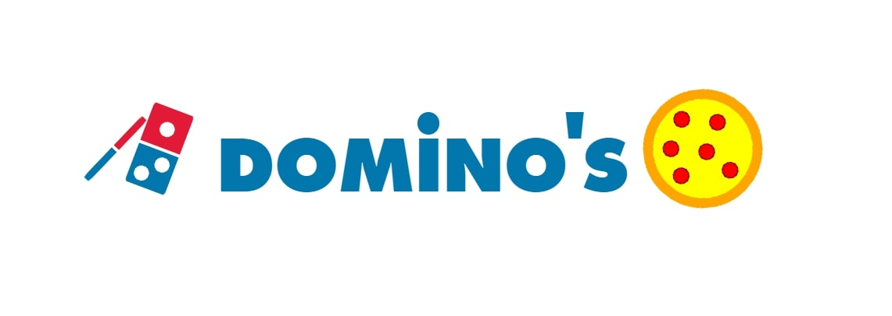
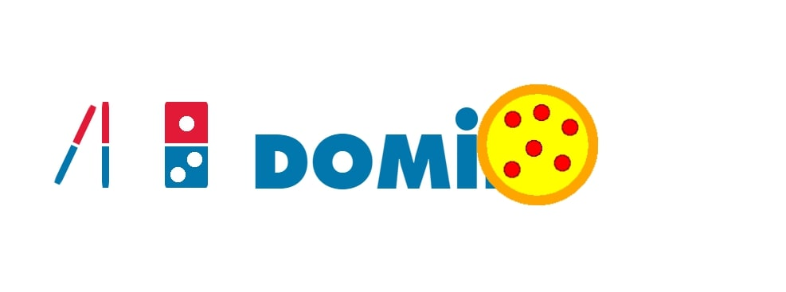

# Procesverslag
**Auteur:** Stef Keuken

**De opdrachten:** [opdracht 1](opdracht1/index.html) en [opdracht 2](opdracht2/index.html)

Markdown is een simpele manier om HTML te schrijven.  
Markdown cheat cheet: [Hulp bij het schrijven van Markdown](https://github.com/adam-p/markdown-here/wiki/Markdown-Cheatsheet).

Nb. De standaardstructuur en de spartaanse opmaak van de README.md zijn helemaal prima. Het gaat om de inhoud van je procesverslag. Besteedt de tijd voor pracht en praal aan je website.

Nb. Door *open* toe te voegen aan een *details* element kun je deze standaard open zetten. Fijn om dat steeds voor de relevante stuk(ken) te doen.

## Bronnenlijst
  1. https://www.fontinlogo.com/logo/dominos-pizza
  2. https://developer.mozilla.org/en-US/docs/Web/CSS/CSS_Animations/Using_CSS_animations

## Opdracht 1 plan

  
Mijn plan voor opdracht 1 is het maken van een animatie met het domino's logo. zo wil ik een paar domino steentjes laten vallen om het logo op de goede plek te krijgen en ook wil ik een rollende pizza in het scherm hebben om dominos naar voren te laten komen.

  ### Je storyboard:
  

  ### Je ambitie: 
  Aan deze technieken/punten wil ik werken:
  - Werken met keyframes
  - werken met :root
 

## Opdracht 1 reflectie

  
Ik ben blij met de animatie die ik heb gecreeerd alleen zou ik nog een paar dingentjes aanpassen, zoals de dominosteentjes die vallen. deze zou ik wat meer realistisch willen laten vallen zodat het er daadwerkelijk uitziet alsof ze vallen en niet gewoon draaien.

  ### Je uitkomst - karakteristiek screenshot(s):
  

  ### Dit ging goed/Heb ik geleerd: 
  Het goed werken met keyframes en animaties is best wel goed gelukt, ook ben ik wat beter geworden in het goed commenten bij mijn css zodat het wat overzichtelijker wordt.

  

  ### Dit was lastig/Is niet gelukt:
  Realistisch laten vallen van de domino steentjes

  

## Opdracht 2 plan

  
uitwerken na schetsen idee (voor week 5)

  ### Je ontwerp:
  

  ### Je ambitie: 
  Aan deze technieken/punten wil ik werken:
  - punt 1
  - punt 2
  - nog een punt
  - ...

## Opdracht 2 test

  
uitwerken na testen (week 7)

  Neem minimaal 5 bevindingen op:

  ### Bevinding 1:
  Omschrijving van wat er nog niet orde was (tekst en afbeeding(en)).

  #### oplossing:
  Beschrijving hoe je het hebt hebt opgelost of als het niet gelukt is hoe je het zou oplossen (tekst en afbeeding(en)).

  ### Bevinding 2:
  Omschrijving van wat er nog niet orde was (tekst en afbeeding(en)).

  #### oplossing:
  Beschrijving hoe je het hebt hebt opgelost of als het niet gelukt is hoe je het zou oplossen (tekst en afbeeding(en)).

  ### Bevinding 3:
  ...

## Opdracht 2 reflectie

  
uitwerken bij afronden opdracht (voor week 8)

  ### Je uitkomst - karakteristiek screenshot(s):
  

  ### Dit ging goed/Heb ik geleerd: 
  Korte omschrijving met plaatje(s)

  

  ### Dit was lastig/Is niet gelukt:
  Korte omschrijving met plaatje(s)

  

